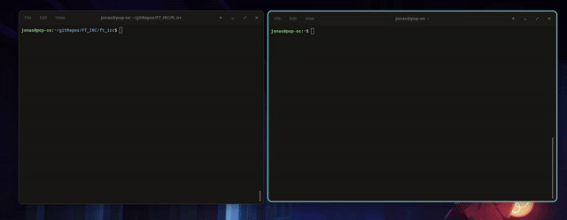

<!--Typing name-->

  
  

<!-- Interests -->
<h3 align="center">🧠 My Main Interests</h3>

  
 </a>
  
   

<!-- Tech-->
<h3 align="center">⚙️ Technologies</h3>

  
  
  
   
  
  
  
  
  
  
  
  
  
  
  
  
  
  

<!-- Projects Showcase -->
<h3 align="center">🚀 My Projects</h3>

  <table>
    <tr>
      <td align="center" width="33%">
        
        
        Raycasting 3D engine inspired by early FPS games.
      </td>
      <td align="center" width="33%">
        
        <a href="https://github.com/oJonasRtz/minishell">
          <!--  -->
          
        </a>
        Unix shell implementation with parsing, AST and process execution.
      </td>
      </tr>
      <tr>
      <td align="center" width="50%">
        
        
         
        
         
        Full-stack web platform where you can play games and socialize.
      </td>
      <td align="center" width="50%">
        
        
        An IRC server designed to work with clients such as irssi.
      </td>
    </tr>
  </table>

<!--Profile status-->
 
  <h3 align="center">📊 Profile Status </h3>
  

    
   
  

  
<!--Contact-->
<h3 align="center">🗨️ Contact Me</h3>

  
  
  

